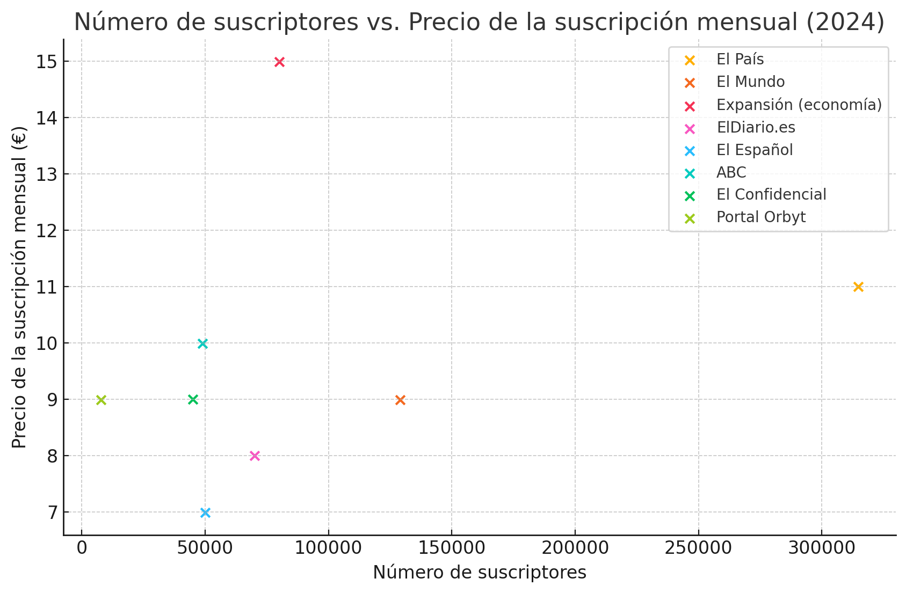
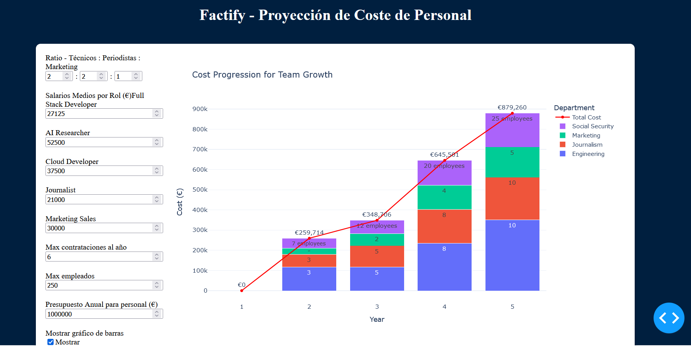
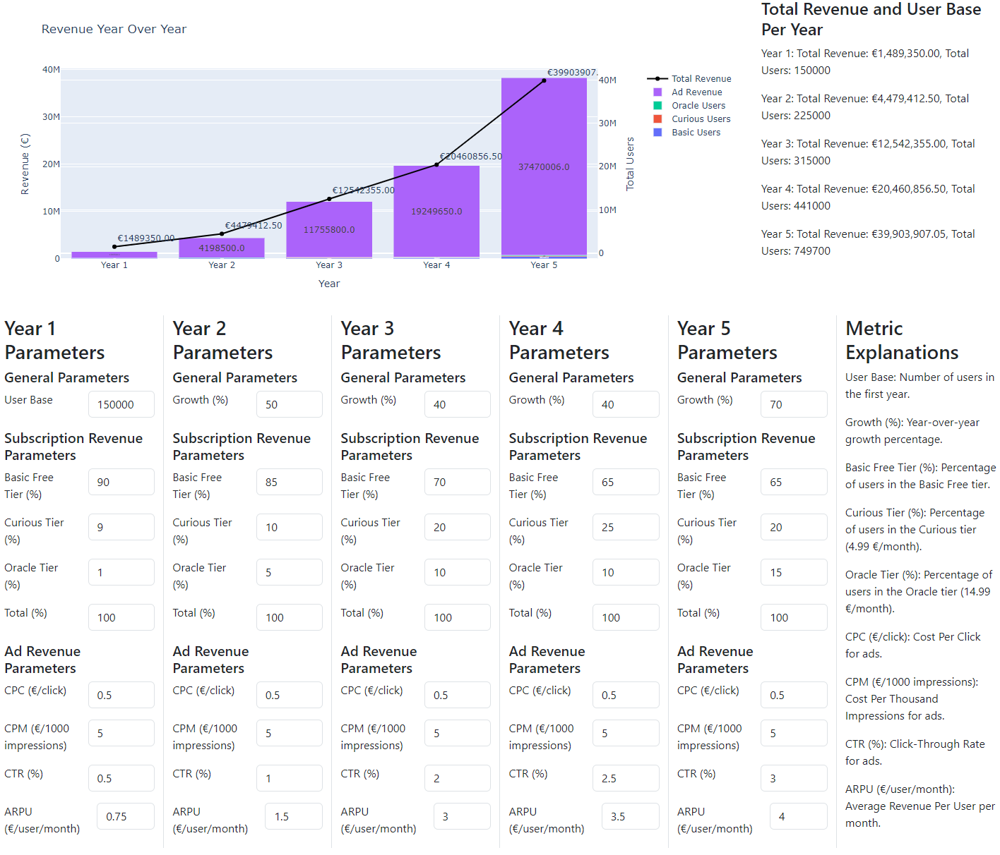

# Factify Financial Analytics Project

## Project Overview
This repository contains the financial analytics and data-driven approach to assess the potential costs and income of Factify, a startup in the ideation phase. This project was completed as part of a final thesis for a business analytics degree.

### About Factify
Factify is a digital news distribution platform that leverages Large Language Models (LLMs) to compare and complete news stories. The platform aims to provide users with a comprehensive view of news topics, including all relevant sources, addressing the issues of newspaper bias and saving users time in contrasting multiple stories and viewpoints.

## Repository Structure

### competencia
- `Datos-Competencia-Factify.xlsx`: Excel file containing subscriber counts and subscription prices for major Spanish newspapers.
- `scatter-plot.py`: Python script to visualize the relationship between subscriber count and price.

*Scatter Plot showcasing relationship between subscriber number and subscription price.*

### cost_projections
- **Team Costs**
  - `coste-equipo/`: Dash App for estimating team hiring costs and projections.
  
    *Dash App to estimate team and hiring costs based on different parameters.*

- **LLM Costs**
  - `Cost_Analysis_Detailed.xlsx`: Breakdown of estimated LLM costs for running the platform.
  - `LLM_Pricing.xlsx`: Comparison of different LLM models and their pricing.
  - `bubble-graph-cost-size.py`: Visualization of LLM pricing properties.
  - `dash-app.py`: Prototype tokenizer and cost estimator for prompts.

### encuestas
Contains data from user surveys and interviews to validate the problem and understand user needs.

### idealista_scrapping
Web scraping scripts and data for estimating office space costs in Spain.
  
    *Graph which analyses over 100 office spaces in Madrid with the objective of finding out average price per square metre.*

### imgs_report
Repository for images used in the report.

### income_projections

*App which can be used to estimate the total revenue and user base per year for the app with a series of modifiable parameters.*
- `income_projections_dash/`: Dash app for estimating app revenue projections.
- `dash-app-ingresos-montecarlo.py`: Monte Carlo simulation for revenue projections.

### Other Files
- `income statement.xlsx`: Compiled financial projections for the first 3 years.
- `requirements.txt`: List of Python dependencies for the project.

## Installation and Usage

1. Clone the repository:
   ```
   git clone https://github.com/your-username/factify-financial-analytics.git
   ```

2. Install the required dependencies:
   ```
   pip install -r requirements.txt
   ```

3. Navigate to specific folders to run individual scripts or Dash applications.

## Key Findings

Somehow this could be a profitable company, however it's unrealistic as we have no real data or operations, it's all an estimate. If you wish to find out more about how I did this and can speak Spanish, the `Trabajo Final de Grado` file goes a lot more into detail about the process and my thinking behind the company. 

## Contact

Send me an email: `yagotobiosouto@gmail.com`